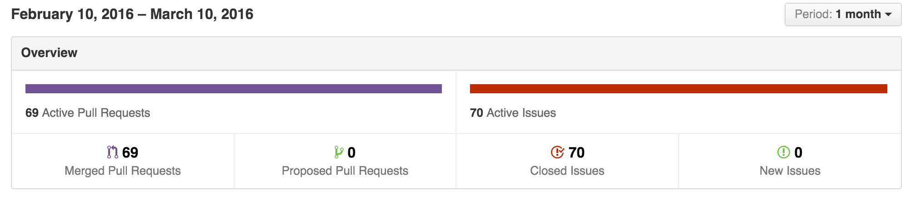
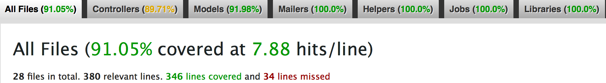

#Little Owl
[](http://waffle.io/weilandia/little_owl.io)

LittleOwl is an enterprise eCommerce app built on rails.  Production is hosted [here](http://tiwizard.com/downloads/fall-down/).

Admin Username: admin@littleowl.com

Admin Password: password

#####Admin Workflow
 
 
#####User Workflow
 
 

###Goals
#####End-to-End UX Design

A primary goal for the Little Owl project was to model UX Design workflow from ideation to production.  We started this process by building a Journey Map to define our ideal users. With an idea of these users defined, we interviewed a group of people who fit "The Persona" in order to gather insights on what type of experience our users would like when interacting with an eCommerce app. Rooted in this research, we wireframed the entire app and did our first round of usability testing without writing a snippet of code.

Moving forward (if the app was live), we would expect to continually interact with our ideal users in an iterative process of continual design improvement.

#####Agile TDD
Another goal for this project was to mock a two week sprint on an agile team with a focus on test-driven-development. We used [waffle.io](https://waffle.io/) to manage issues and pull requests and we used [simplecov](https://github.com/colszowka/simplecov) to monitor test coverage.





####Technical Overview
* Full stack ruby-on-rails
* jQuery
* SendGrid API
* Stripe API
* Amazon Web Services S3 API
* Paperclip
* Testing with rspec and Capybara

### Testing
All testing in Little Owl was done via [RSpec-rails](https://github.com/rspec/rspec-rails).  We used [shoulda matchers](https://github.com/thoughtbot/shoulda-matchers) to test database validations and relationships.  Our coverage was tested using [simplecov](https://github.com/colszowka/simplecov).
##### Running tests
Once you have the repo cloned, make sure to reset the database on your local machine and bundle.

In order to run the tests, enter `rspec` in the command line.

If you would like to run a specific test enter, the whole path of that test, preceeded by the rspec command: ie. 

```
rspec spec/features/user/user_adds_product_to_cart_spec.rb
```

In order to see coverage for our testing suite simply type the command `open coverage/index.html` and it will show the index page for our simple cov code coverage. 

Happy testing!

###Team

&nbsp;&nbsp;&nbsp;&nbsp;&nbsp;&nbsp;&nbsp;&nbsp;&nbsp;&nbsp;&nbsp;&nbsp;&nbsp;&nbsp;&nbsp;&nbsp;&nbsp;&nbsp;&nbsp;&nbsp;&nbsp;&nbsp;&nbsp;&nbsp;&nbsp;&nbsp;&nbsp;&nbsp;[Adam](https://github.com/adamhundley)&nbsp;&nbsp;&nbsp;&nbsp;&nbsp;&nbsp;&nbsp;&nbsp;&nbsp;&nbsp;&nbsp;&nbsp;&nbsp;&nbsp;&nbsp;&nbsp;&nbsp;&nbsp;&nbsp;&nbsp;&nbsp;&nbsp;&nbsp;&nbsp;&nbsp;&nbsp;&nbsp;&nbsp;&nbsp;&nbsp;&nbsp;&nbsp;&nbsp;&nbsp;&nbsp;&nbsp;&nbsp;&nbsp;&nbsp;&nbsp;&nbsp;&nbsp;&nbsp;&nbsp;&nbsp;&nbsp;&nbsp;&nbsp;&nbsp;&nbsp;&nbsp;&nbsp;&nbsp;&nbsp;&nbsp;&nbsp;[Nick](https://github.com/weilandia)&nbsp;&nbsp;&nbsp;&nbsp;&nbsp;&nbsp;&nbsp;&nbsp;&nbsp;&nbsp;&nbsp;&nbsp;&nbsp;&nbsp;&nbsp;&nbsp;&nbsp;&nbsp;&nbsp;&nbsp;&nbsp;&nbsp;&nbsp;&nbsp;&nbsp;&nbsp;&nbsp;&nbsp;&nbsp;&nbsp;&nbsp;&nbsp;&nbsp;&nbsp;&nbsp;&nbsp;&nbsp;&nbsp;&nbsp;&nbsp;&nbsp;&nbsp;&nbsp;&nbsp;&nbsp;&nbsp;&nbsp;&nbsp;&nbsp;&nbsp;&nbsp;&nbsp;&nbsp;&nbsp;&nbsp;&nbsp;&nbsp;&nbsp;&nbsp;&nbsp;[David](https://github.com/damwhit)
